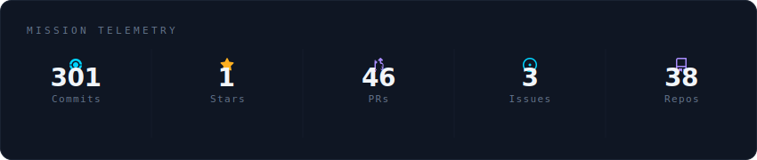

<!-- Galaxy Profile README Template
     Customize this file with your own info, then rename it to README.md
     in your GitHub profile repo (github.com/YOUR_USERNAME/YOUR_USERNAME).
     The SVG paths below point to assets/generated/ which are auto-generated
     by the GitHub Actions workflow or by running: python -m generator.main -->

  

 

  

 

  

 

  

 

<strong>More about me</strong>

 

🎯 Beyond the Code:

Many know me as "Caos" (Chaos), but not for the common definition of disorder. To me, "Caos" represents the raw energy that precedes creation—the drive to transform complex chaos into structured, functional, and scalable solutions.

𝄞 Musician: Music is where I draw my creativity for problem-solving and the discipline required for continuous, lifelong learning.

🏎️ Automotive Enthusiast: I look to the world of motorsports for inspiration in performance optimization and precision engineering. I believe great software should run as efficiently as a high-performance engine.

 

  
  
  
  

